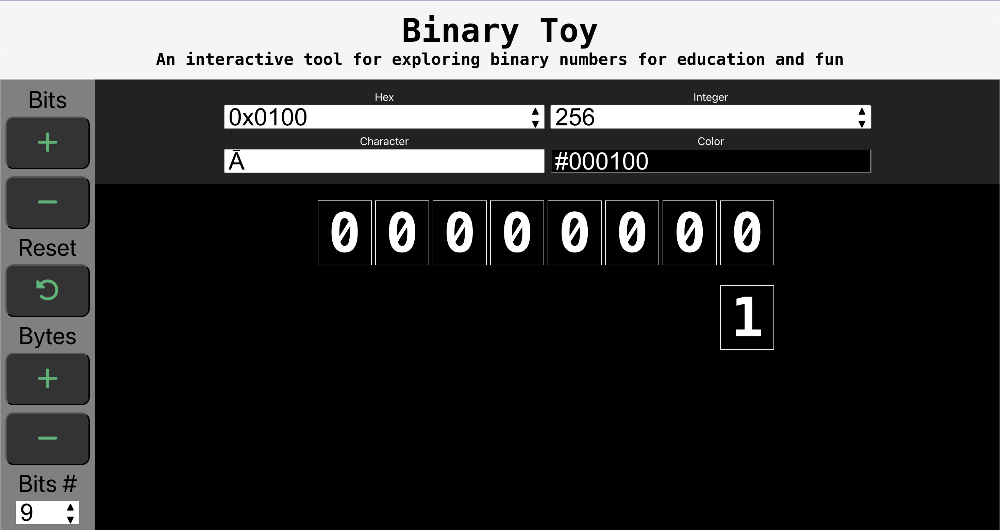

Very simple sample React project I made for my son to play around with binary numbers as he learns more about computer science.  Also, for me to learn more about front-end development.

TODO: allow user to enter a number (or other item) directly to see the binary number configuration change in real-time

